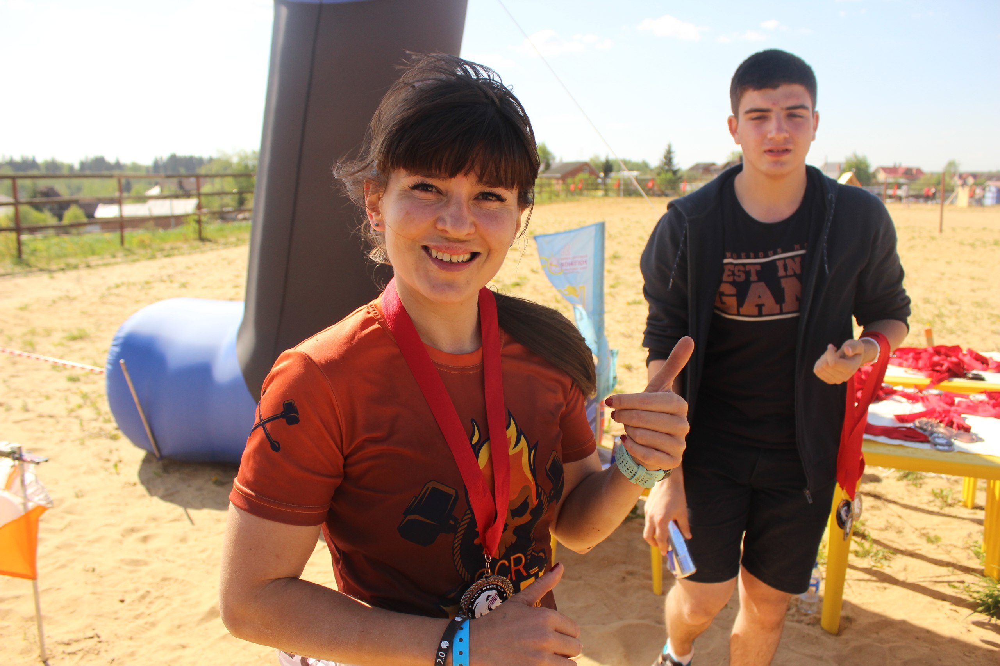

# Голубева Светлана

описание кто такая Светлана

 Я редко привязываюсь к людям, местам и событиям, всегда любила покорять что-то новое и двигаться дальше.  
  
Можно по пальцам пересчитать мероприятия на которые я люблю возвращаться и с чувством искреннего удовольствия проходить по знакомым местам \( или не очень знакомым\) ,но каждый раз сталкиваться с новыми препятствиями.  
  
Одно из таких мероприятий это [@Lion](https://vk.com/lion) Race,не буду лукавить если скажу,что самый первый раз выбрала этот забег из-за его локации,где это видно,что гонка в 20 минутах езды от моего дома;\) обычно я еду часа два,а то и больше. День икс еду на встречу новым приключениям от организаторов Lion, почему то волнения была мало, честно не ждала от гонки чего-то сверхъестественного \(прости организатор\).  
  
Ох как я ошиблась! Огромное количество знакомых,все душевно подбадривают друг друга, улыбаются и призывают к конкуренции на трассе\). Такая добрая ,бомбическая обстановка,что сносило крышу от энергетика всех присутствующих. Спросите какая была трасса? Сложная, убийственная для рук\( привет слэклайн\), мокрая и грязная \(и тебе ров с брёвнами привет\) ,и мозоль стирающая \(долгие кольца я вас помню\). Это самая малая часть моих приветствий ;\).  
  
Но! Я в октябре решила не бегать зимой вообще, холодно, скользко и лень\(я сказала это вслух ;\). Ноябрь открыта регистрация на зимний Lion, я держусь подальше от регистрации. Декабрь загадываю желание открыть сезон как можно раньше.Январь обзор медали, ну зачем мне это надо,я не бегаю за медали \( кого я обманываю\).  
  
Февраль я в деле,в деле с Lion в зимний период,ну люблю я эту гонку и рядом она\) тут все карты на моих руках. А как насчёт тебя? Ты в деле? Lion Race Winter - гонка с препятствиями ,уже 23 февраля. Ps я два раза была на тумбочке у Lion ;\)



