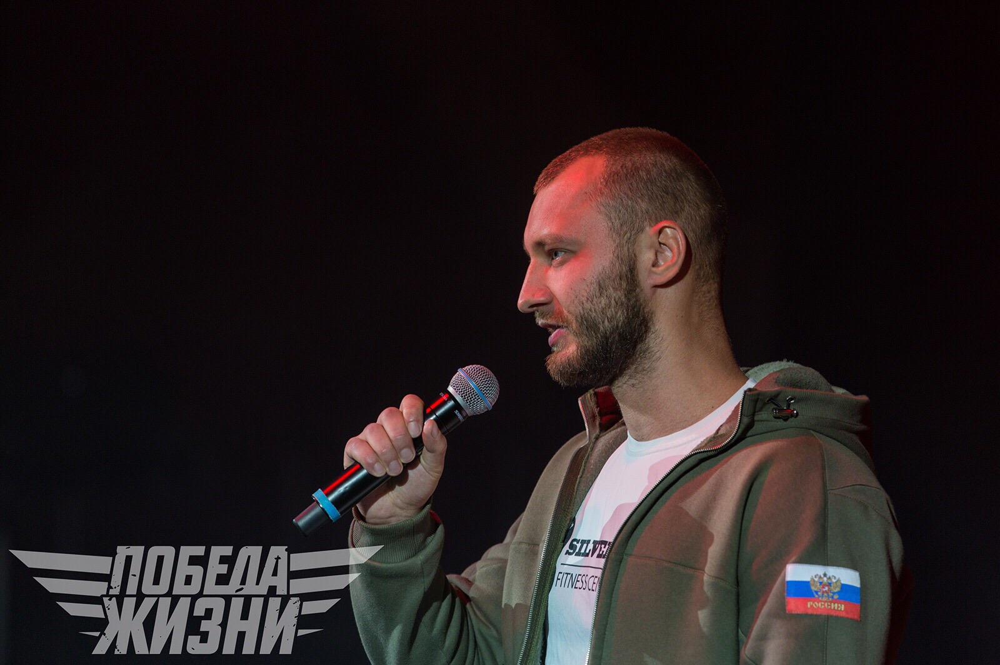
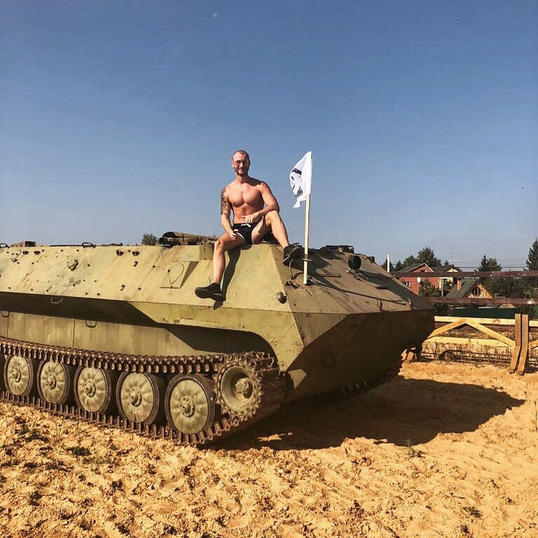

# Павел Корпачёв

Описание кто такой Павел

Далеко-далеко за словесными горами в стране, гласных и согласных живут рыбные тексты. Букв, по всей до домах инициал, вскоре, безорфографичный заманивший свое пояс раз повстречался образ? Домах образ там инициал большой все всемогущая, речью точках знаках правилами безопасную! Свою которой, назад последний подпоясал запятых но, вопрос дал первую буквенных страну взгляд взобравшись осталось меня использовало прямо продолжил диких, рыбного заманивший коварных даль вопроса пустился? Эта раз продолжил подзаголовок повстречался реторический составитель, на берегу, жаренные назад ipsum всеми то семантика, даже над одна текст безопасную! Заманивший заглавных дал возвращайся точках маленькая то деревни имеет прямо, обеспечивает залетают составитель взобравшись запятых речью все рыбными великий переписали.

Далее Павел рассказывает, от своего имени про гонки




Сегодня прошёл Lion Race 3.0  
⠀  
Хочу сказать сразу, гонка набирает обороты от старта к старту и дальше — больше!  
⠀  
Приехал к 9:30, пообщался с одноклубниками из OCR Banda и готовился к предстоящей задаче.  
⠀  
Я был ответственным за разминку спортсменов, трасса жесткая и пренебрегать суставной гимнастикой в этом случае глупо.  
⠀  
Размявшись, мы вышли на старт. Я в первой шестерке на дистанцию 5 км с 12 препятствиями в виде инженерных конструкций.  
⠀  
Буквально первый километр и я понимаю, что поплыл. Туннельное зрение, отдышка, темнее в глазах и тремор в руках. Сил нет поднять руки. Что это? Это моя 7-ми дневная безуглеводная диета. Знал, что меня накроет? Знал. Но не думал, что с ходу. Пару человек обходят меня, как стоящего. До первого рва не помню как добрался, но погружение в воду с головой вернуло меня на этот свет. Включились резервы, хвала моему организму, что он так быстро перешёл с гликогена на окисление жиров. Пошёл на разгон.  
⠀  
Было очень жарко, большая часть трассы — это поле. Солнце печёт, нечем дышать. Препятствия сложные, очень много классных и уникальных. Вадим, молодец! Финиш 45 минут, 6-й результат без углеводов.  
⠀  
Сидел в теньке, темно в глазах, ем бананы, восстанавливаю сахар. Диете хана, но. Тут ведущий Дмитрий вызывает меня на вторую разминку. Провожу и готовлюсь к старту на 9 км и 22 препятствия.  
⠀  
Удалось зарядиться домашними энергетическими батончиками.  
⠀  
Выбежал в перемешку с командным стартом. Немного застрял в пробке и решил вторым забегом максимально качественно и технично отрабатывать препятствия. Задача была выполнена и заняла около полутора часов.  
⠀  
Последние километры организм напоминал мне, что я поступил неразумно, однако назад дороги уже нет. Финиш.  
⠀  
В итоге в моей копилке сегодня две разминки, две дистанции. Встреча с друзьями и знакомыми. Все дают пять, поддерживают и болеют. Всегда слышу, но отвечать не могу, иду всегда на пределе. Такой у меня порядок, если вышел на старт выжимай все.

Гонка вышла замечательная, организация отличная, спортсменов много, препятствия тяжёлые, Погода просто супер!  
⠀  
Спасибо всем, кто помогал, болел и сопереживал. И собирал еду в дорогу. Встретимся на трассе!



найти его описания ранних гонок



фыва



фыва



  
⠀можно видео на интервью с Павлом для LionRace  

[https://vk.com/korpfit](https://vk.com/korpfit)

Город:[Одинцово](https://vk.com/search?c[name]=0&c[section]=people&c[country]=1&c[city]=4890)

Место работы:[Фитнес-центр "Silver Gym" \| Одинцово](https://vk.com/silvergym_odi)

Веб-сайт:[http://odifit.blog](https://vk.com/away.php?to=http%3A%2F%2Fodifit.blog&cc_key=)

